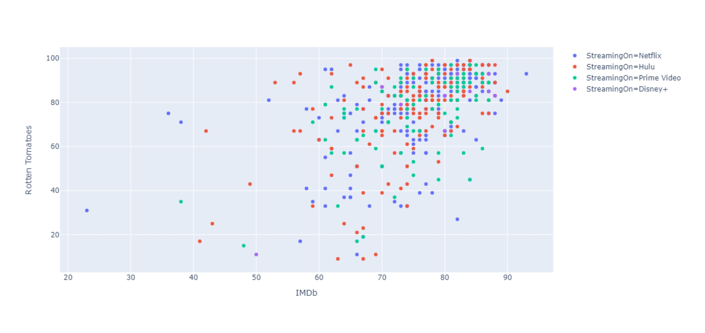

# Data Analytics Projects

## [Project 1: Best Streaming Service](https://danieldessalew.github.io/BestStreamingService)

### Analyzing a TV Shows dataset to determine the best streaming service with Python.

## [Project 2: Instagram Impressions](https://danieldessalew.github.io/InstagramImpressions/)

### Analyzing an Instagram dataset to better understand and predict the interactions algorithm with Python.

## [Project 3: HR Data Tableau Dashboards](https://danieldessalew.github.io/HRData-TableauDashboards/)

### Building Tableau dashboards with an HR dataset.

