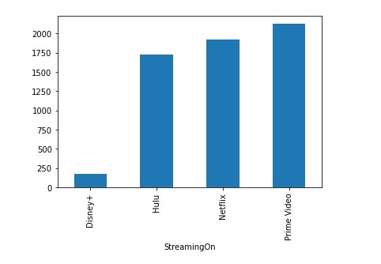
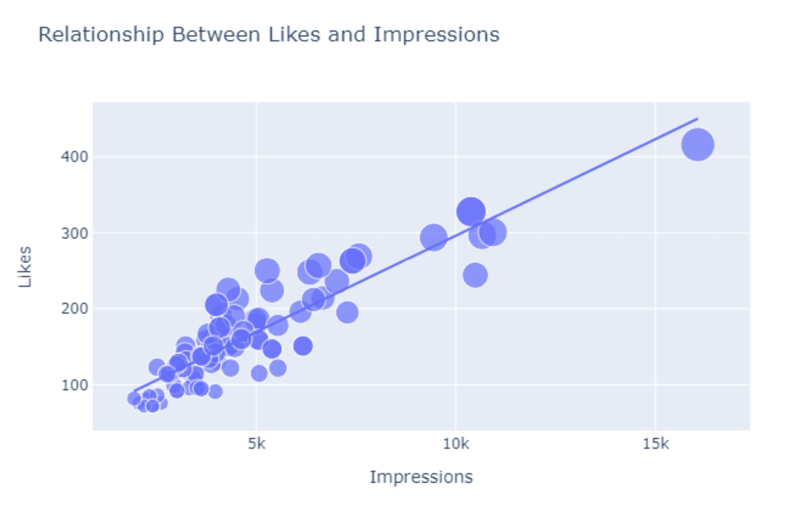
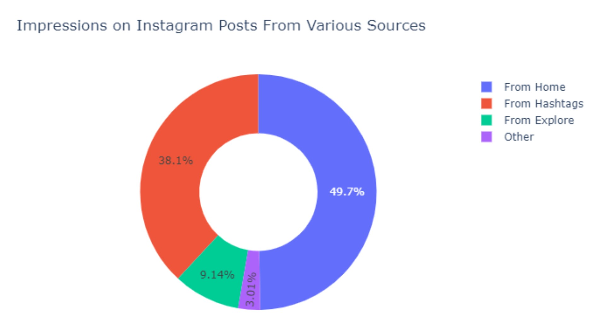
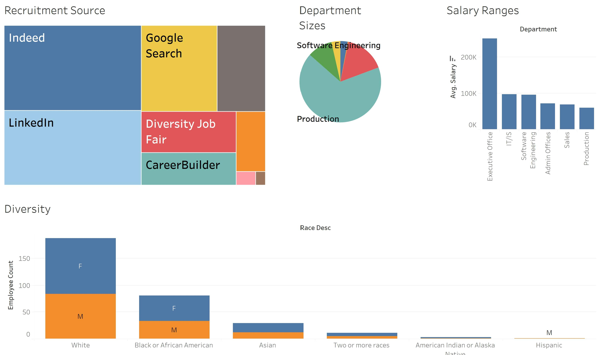
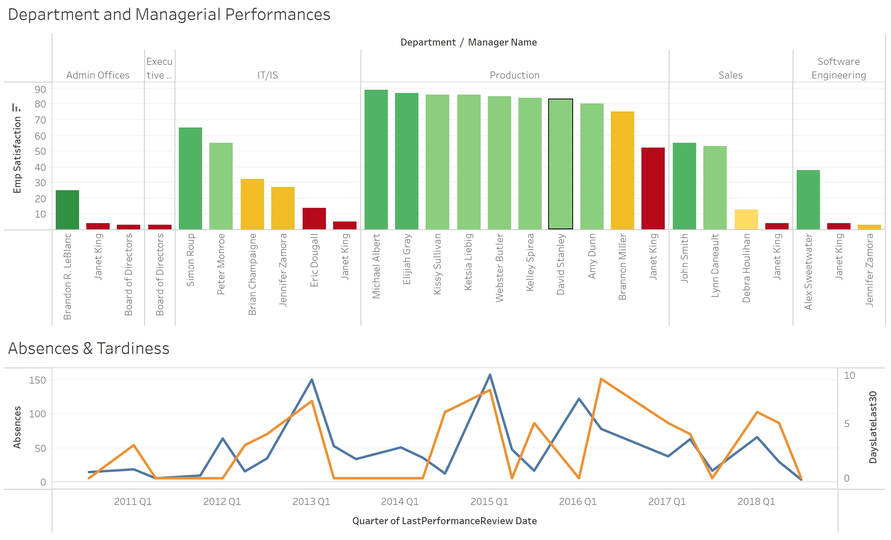

# Data Analytics Projects

## [Project 1: Best Streaming Serviece](https://danieldessalew.github.io/BestStreamingService)

### Analyzing a TV Shows dataset to determine the best streaming service with Python.

## Project 2: Instagram Impressions 

### Analyzing an Instagram dataset to better understand and predict the interactions algorithm.

## Project 3: HR Data Tableau Dashboards

### Building Tableau dashboards with an HR dataset.

